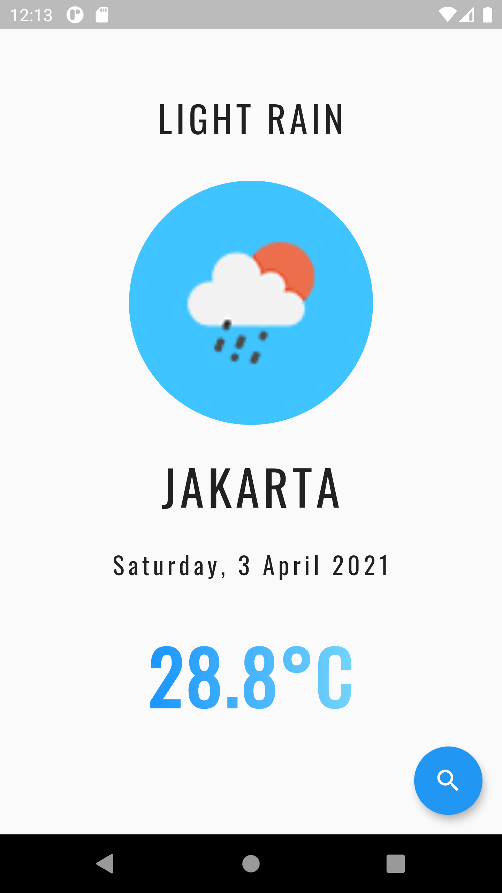
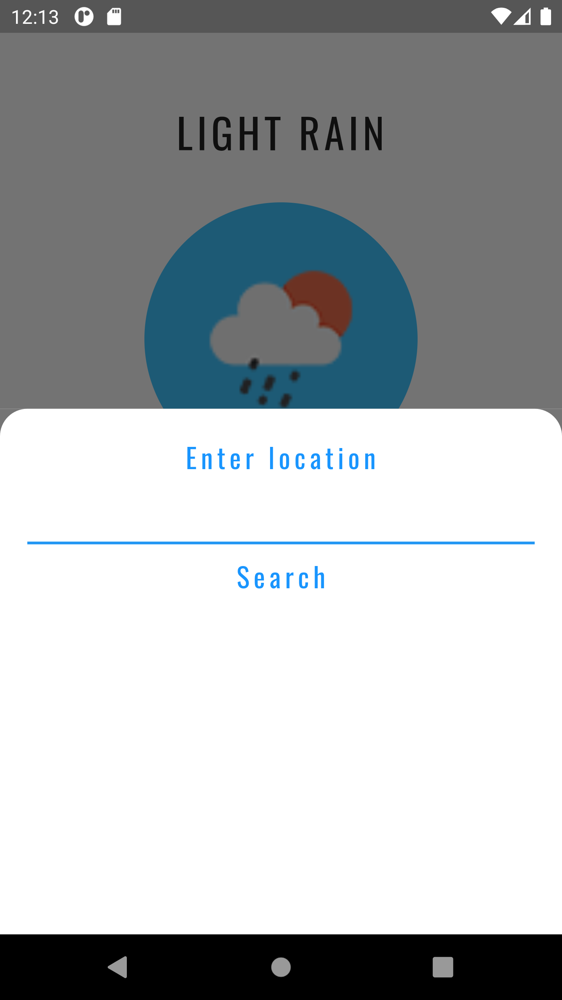
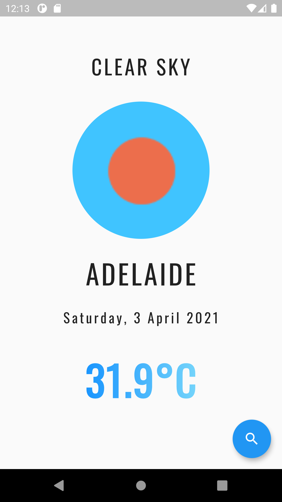
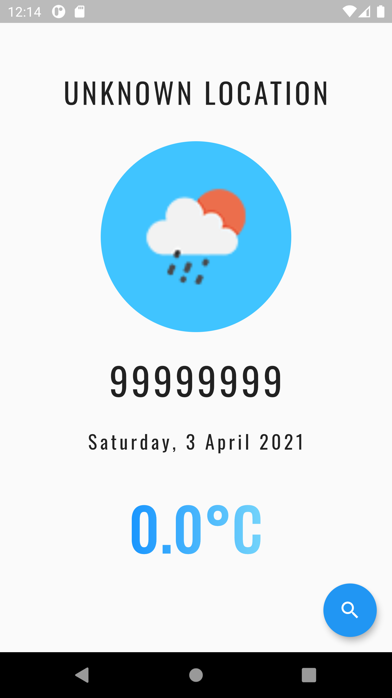

# weather_checker

Weather Checker made with Flutter

Screenshots below ran on the Nexus 6 virtual device, not yet tested on an iOS device

Data from the <a href="https://openweathermap.org/">Open Weather API</a>

Font : <a href="https://fonts.google.com/specimen/Oswald?query=oswald">Oswald</a>

<h2>Startup Screen</h2>

 
<h2>Search Screen</h2>

 
<h2>Search Results</h2>

 
<h2>Error handling</h2>

